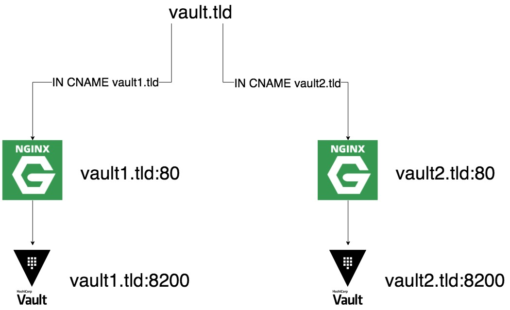

# NGINX As Reverse Proxy For Hashicorp Vault
I created a [Blog Post](https://keyboardinterrupt.org/nginx-as-reverse-proxy-for-hashicorp-vault/) which explains how to set up an NGINX as a reverse proxy / load balancer for Hashicorp Vault.

All examples can be found in this repository.

## NGINX - Named Locations
You can run the `Named Locations` example with the following commands.
```shell
# $: cd named_locations
# $: chmod u+x run.sh
# $: ./run.sh
```

When the container is started you are able to open the NGINX with the following routes:
- [http://localhost/](http://localhost/)

## NGINX - Upstreams
You can run the `Upstreams` example with the following commands.
```shell
# $: cd upstreams
# $: chmod u+x run.sh
# $: ./run.sh
```

When the container is started you are able to open the NGINX with the following routes:
- [http://localhost/](http://localhost/)
- [http://localhost:81/](http://localhost:81/)
- [http://localhost:82/](http://localhost:82/)